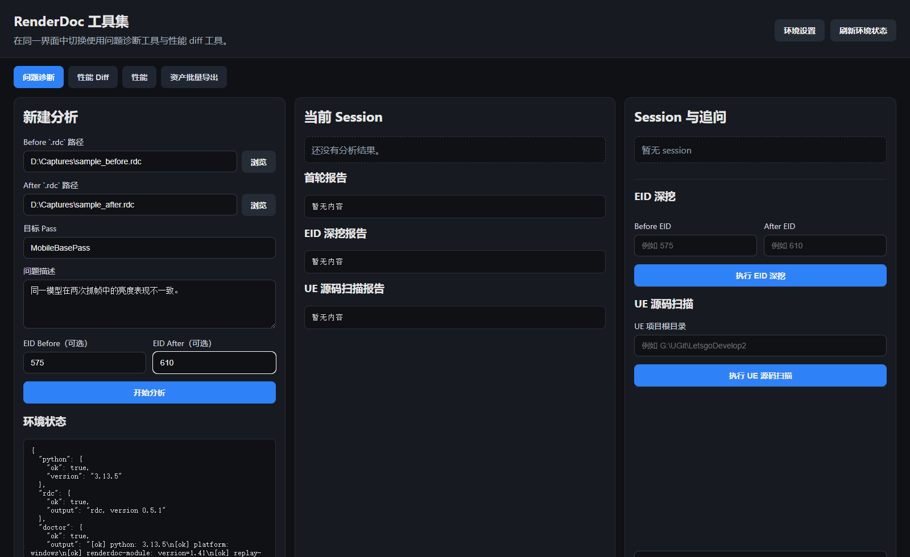
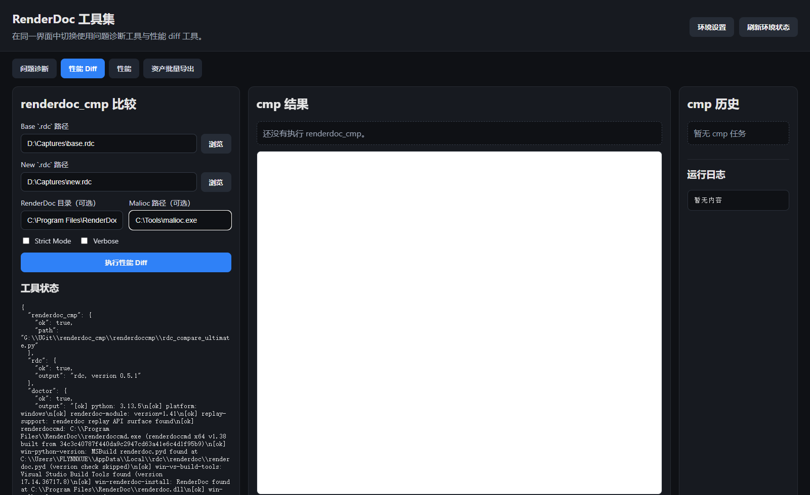
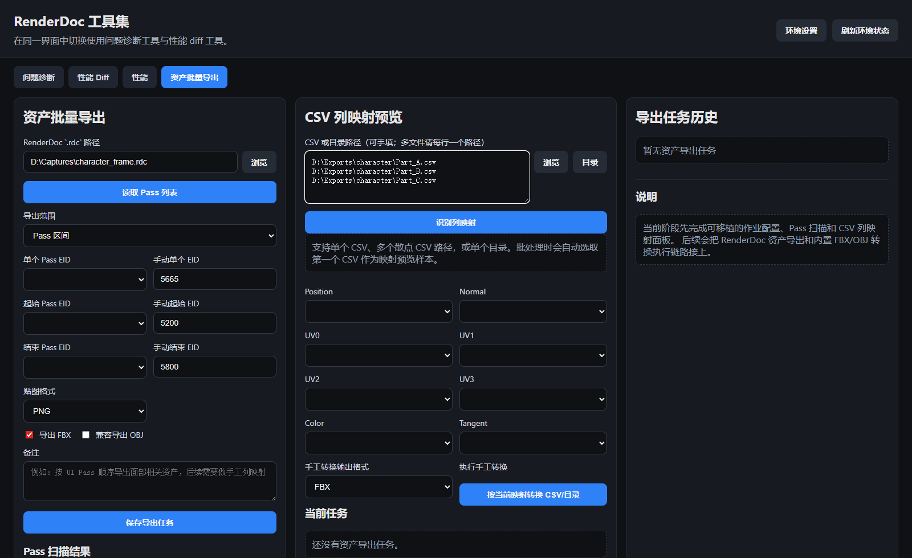

# RenderDoc 工具集

一个面向本地使用的 RenderDoc 桌面工具集，用来帮助图形程序、TA 和技术美术更高效地分析 `.rdc` 抓帧、比较差异、查看性能热点，以及批量导出资产。

项目当前以 Windows 本地桌面模式为主，界面运行在内嵌窗口中，直接读写本机文件，不依赖远程上传大型抓帧文件。



## 功能总览

工具当前提供四个主要功能页：

| 功能 | 说明 |
| --- | --- |
| `问题诊断` | 对比两份 `.rdc`，结合目标 Pass、问题描述、可选 EID，生成首轮诊断报告，并支持继续追问 |
| `性能 Diff` | 基于 `renderdoc_cmp` 对两份抓帧做性能差异分析，并在界面内查看 HTML 报告 |
| `性能` | 针对单个 `.rdc` 做 Pass 级性能分析，支持多维排序、热点提示和绘制预览 |
| `资产批量导出` | 扫描 Pass、批量导出资产、导出当前 draw 的 shader/参数、检查 CSV 列映射，并将 CSV 转换为 `FBX` / `OBJ` |

## 适用场景

- 比较两次抓帧的渲染差异，快速定位“亮度不一致”“材质异常”“某个部位表现异常”等问题
- 复盘单帧性能，快速找出高开销 Pass 和热点绘制项
- 从抓帧中批量导出网格、贴图、shader 与参数，并完成 CSV 到模型格式的转换
- 在本地持续保存分析记录、历史任务和结果文件，便于回查

## 快速开始

### 运行前准备

- Windows 环境
- 已安装 RenderDoc
- 可用的 Python 环境

如果仓库后续提供发布包，优先使用 Release 中的绿色包；如果是从源码运行，请按下面步骤安装依赖并启动。

安装依赖：

```powershell
python -m pip install -r requirements.txt
```

如果需要手动安装打包依赖，也可以执行：

```powershell
python -m pip install pyinstaller
```

启动桌面工具：

```powershell
python launcher.py
```

程序会启动本地服务，并以内嵌桌面窗口打开界面。

### 打包绿色运行包

项目根目录提供了一键打包脚本：

```bat
build_portable.bat
```

它会自动调用：

```powershell
powershell -ExecutionPolicy Bypass -File .\build_portable.ps1
```

默认输出目录为：

```text
G:\RenderdocDiffTools\RenderdocDiffPortable
```

如果你想指定输出根目录，可以直接给 `.bat` 传参，参数会透传给 `build_portable.ps1`：

```bat
build_portable.bat -OutputRoot "D:\YourOutput"
```

打包脚本会自动完成以下步骤：

- 关闭正在运行的旧绿色包进程
- 清理项目内的 `build/` 和 `dist/`
- 调用 `PyInstaller` 重新打包
- 复制绿色包到目标输出目录
- 打包仓库内置的 `external_tools/renderdoccmp` 运行时
- 生成绿色包内的 `user_data/config/settings.json`
- 自动执行绿色包冒烟测试
- 检查 `RenderdocDiffPortable\RenderdocDiffTools.exe` 是否生成成功，并在成功后自动打开输出文件夹

打包完成后，直接运行以下文件即可：

```text
RenderdocDiffPortable\RenderdocDiffTools.exe
```

### 首次配置

首次使用时，建议在界面右上角的 `环境设置` 中确认以下项目：

- `RenderDoc Python Path`
- `LLM Provider`
- `OpenAI-compatible Base URL`
- `OpenAI-compatible API Key`
- `OpenAI-compatible Model`
- `renderdoc_cmp 根目录`

如果不配置在线模型，工具会使用本地回退逻辑完成基础问答与分析流程。

当前仓库已经内置 `renderdoc_cmp` 运行时，默认打包和绿色包运行不再依赖单独下载外部 `renderdoc_cmp` 仓库；只有当你想显式覆盖内置版本时，才需要额外填写 `renderdoc_cmp 根目录`。

## 使用文档

- [用户使用指南](docs/USER_GUIDE.md)
- [截图清单与拍摄规范](docs/SCREENSHOT_CHECKLIST.md)

## 常见工作流

### 1. 问题诊断

1. 打开 `问题诊断`
2. 选择 `Before` 和 `After` 两份 `.rdc`
3. 输入目标 Pass 和问题描述
4. 如有需要，补充 `EID Before / EID After`
5. 点击 `开始分析`
6. 在当前 Session 中继续做 `EID 深挖`、`UE 源码扫描` 和追问

### 2. 性能 Diff

1. 打开 `性能 Diff`
2. 选择两份待比较的 `.rdc`
3. 按需填写 `RenderDoc` / `Malioc` 路径和附加选项
4. 点击 `执行性能 Diff`
5. 在中间区域查看内嵌报告和运行日志



### 3. 单帧性能分析

1. 打开 `性能`
2. 选择单个 `.rdc`
3. 点击 `执行性能分析`
4. 使用排序维度和排序方向查看热点
5. 结合图表、日志和绘制预览定位高开销 Pass

### 4. 资产导出与 CSV 转模型

1. 打开 `资产批量导出`
2. 读取 Pass 列表并选择导出范围，或直接手动填写单个 `EID`
3. 按需启用 `FBX` / `OBJ`
4. 导出前确认批量映射
5. 在 `CSV 列映射预览` 中检查或调整列映射
6. 对单个 CSV、多份散点 CSV 或整个目录执行转换

资产导出完成后，默认会在导出目录中生成以下内容：

- `csv/`：当前 draw 的 VS 输入导出结果
- `models/`：`FBX` / `OBJ` 模型文件
- `textures/`：当前 draw 绑定的贴图导出
- `shaders/`：当前 draw 的 shader 与参数文件

其中 `shaders/` 目录下会包含：

- `*_vs.glsl`：顶点阶段文本
- `*_fs.glsl`：片元阶段文本
- `*_shader_params.json`：常量块、资源绑定、参数值等反射信息

注意：

- 如果填写了“手动单个 EID”，它会优先于下拉框中的 Pass 选择。
- 下拉框中的同名材质或 marker 会按实际 draw 出现顺序拆成多项，例如同一材质先后出现在 `EID 291` 和 `EID 447`，会显示为两条独立项，避免误导性地合并到同一个 Pass。
- 某些抓帧里 RenderDoc 不一定暴露原始 `GLSL` 文本；此时工具仍会导出当前可用的最佳 shader 文本表示，文件名保持为 `*_vs.glsl` / `*_fs.glsl` 以便统一整理。



## 已知限制

- 当前主要面向 Windows 本地桌面环境
- 依赖本机安装 RenderDoc
- 不同图形 API、不同抓帧来源下，部分计数器或命名信息可能存在差异
- 某些移动端 / 真机抓帧的表现与桌面抓帧不同，分析结果需要结合实际 RenderDoc 视图交叉确认

## 项目结构

```text
app/                     FastAPI 应用与前端模板
docs/                    用户文档与技术方案文档
config/                  本地配置
launcher.py              桌面入口
build_portable.ps1       绿色包打包脚本
RenderdocDiffTools.spec  PyInstaller 打包配置
```

## 延伸阅读

这些文档更偏技术方案与设计背景，适合希望了解内部实现的读者：

- [RenderDoc Web UI 技术方案](docs/RENDERDOC_WEBUI_TECHNICAL_PLAN.md)
- [RenderDoc 与 UE 自动诊断方案](docs/RENDERDOC_UE_AUTOMATION_PLAN.md)
- [RenderDoc Comparison Tool](https://git.woa.com/xinhou/renderdoc_cmp/tree/v1.x/renderdoccmp)
